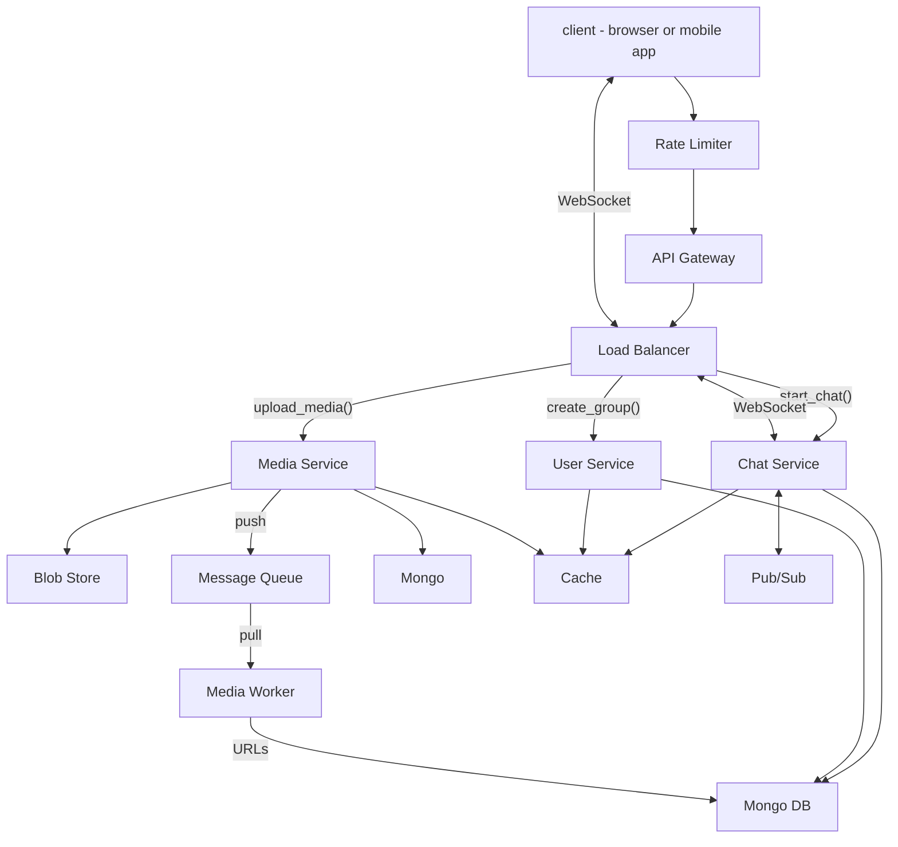

# Facebook Messenger

## System Requirements
### Functional

Messenger is a chat applicaiton.
User is able to:
* Have a one on one chat with another user;
* In other words, user can send a message to another user;
* They can view a message from the chatting partner;

* User can also create a group for chat;
* User can manage (members added and removed) the group;
* User can delete the group;
* In which user can send a message to the group;
* User can view messages from other users from the group;

* Messages will be stored for 1 year;

If I have time, I will design additional features:
* Some texts are converted into emojis;
* User can upload and view images and videos.

### Non-Functional

Support Web clients and mobile clients.

Scalable - 500M DAU
Low Response Time - message appears in everyone's chat window within 200-300ms after being typed
Availability
Reasonably strong consistency. We would like to minimize of inconsistnen communication, e.g., messages arriving out of order. But it does not need to be a strong consistency like ACID properties. Eventual consistency with reasonable limit (e.g. messages become ordered within 1 second) would suffice.

Error scenarios to note:
Network failure preventing user from sending messages and receiving messages. Both cases should be considered and guarded against.

## Capacity Estimation

500M DAU
Each person spends 10 minutes on chat, on average.
Each person generates 2KB of text every day.
Each person generate 1MB of media data (pictures or videos) every day.

500M * 2KB = 1TB text data each day.
To store the conversations up to 1 year, data size would be 1 TB. Assuming 50% compression ratio, it would be 500GB.

Assuming data is replicated in 3 ways, that would be 1.5TB of data.

500M * 1MB = 500TB of media data every day.
Assuming 5:1 compression ration, it would be 100TB media data every day. 36PB for a year.

Assuming 3 way replication, that would be 144PB for a year.

At peak, let's say 20% of users - 100M users - can be chatting in one second.

## API Design

At an API level, I will try to combine 1-1 chat and group chat. In other words, 1-1 chat is a special case of a group chat (where only 2 users participate).

* **create_chat_group(participants' user IDs)**: returns group ID
* **join_chat(user_ID, group_ID)**: this establishes a WebSocket connection between the client (browser or mobile app) and the server (Chat Service).

Within the WebSocket connection, the following JSON messages are sent:

User -> Service:
```
{
    'message_ID': "",
    'message': "",
    'media_links': [URL, URL, ...]
}
```

Service -> User:
```
{
    'message_ID': "",
    'timestamp': ,
    'message': "",
    'media_links': [URL, URL, ...]
}
```

* **upload_media(user_ID, content, metadata)**: client uploads media file. Service return media URL.

## Database Design

For the media files (images and videos), blob store would be the most appropriate data store, due to the expected size (in petabytes) and the nature of the files (write once, read many times).

An interesting design question is whether to store media files in CDN. I lean toward no, because, the media files are viewed only by participants of a chat. I would imagine this would be usually between 10, instead of millions of users. As such, no media files will be needed by millions of users. Therefore, it does not suit CDN's caching capability well. Instead, we will cache in our datacenter.

For the text data, at 500GB for 1 year, this seems to fit with a document NoSQL DB, such as MongoDB.

The text data does not require strong consistency guarantees, so we do not have to rely on RDB's ACID properties.

Wide column DB such as Cassandra would even more scalable than document DB, but at 500GB / year, I believe this is a range suitable for MongoDB.

Mongo's schema flexibility and transaction support will be helpful for future product enhancement.

Although wide column DB would be even more horizontally scalable, its rigid schema design and lack of indexing support would make it unsuitable for this data model.

Important Data Models:

**Message**:
* Message ID (primary key)
* Sender (user_ID): index
* Timestamp: index
* Message
* Media Link (URLs)

Message. Timestamp presents an interesting design choice. Should it be timestamped by client or by server? I lean toward relying solely in server's timestamp, as it would be much easier to keep servers time in sync at a reasonable level. We don't have a control over clients' clock (and clock skews). One advantage of client side timestamp is that a user will be able to prove they have sent a message by the client side timestamp, even if the message transmission fails due to a network failure. But we are mainly building this for consumer use, instead of a legal use. Therefore, this advantage of client side timestamp can be deprioritized.

The data should be indexed by the message ID (primary key), sender, and the timestamp.

Users' geographic location can be used in data partition. I would assume (should be tested) most chat groups would have a strong geographic locality, in other words, they would happen in one geographic region. So, it would make sense for the chat data (text and media) to be primarily stored in, and served by, one data center. But the data should be replicated, asynchronously, to other data centers in other regions for fault tolerance.

## High-Level Design

Rate Limiter prevents Denial of Service attacks.

API Gateway forwards clients' requests to different microservices, considering the type of requests.

Load Balancer forward the request to an appropriate service, depending on the workload of each server. Weighted round robin algorithm can be used for this.

I chose to have multiple microservices because they serve such different purposes.

Chat Service is responsible for initiating and serving WebSocket connections. (It might be beneficial to further split WebSocket server and Chat service. This would be future consideration.)

Meida Service is responsible for receiving media files and storing them in blob store. It also creates a message in message queue, initiating an async process.

Media Worker takes a message from the message queue, compressing and converting original media file into multiple versions (sizes and formats appropriate for different clients), and storing the resulting URLs on MongoDB.

User Service is responsible for managing users and groups.

I have focused the architecture within one data center. As discussed in database design, it would make sense to have multiple data centers in multiple geographic regions for response time (closer to user), fault tolerance (in case of natural disaster), and scalability. I'll come back to multiple data centers if I have time.

Client should maintain local cache of messages to be sent. It is quite common network failure prevents the client from sending the message. The client should retry, perhaps every minute, and perhaps 3 times. If it fails to send it ultimately, it should clearly tell the user that the sending failed. Silently failing would be very bad for users.

Likewise, Chat Service should have a retry mechanism, in case it fails to send a message via WebSocket. Chat Service should be quite persistent in sending it. When a client connects to Chat Service, it should attempt to deliver all the messages it failed to send earlier.



## Request Flows
*Explain how the request flows from end to end in your high level design. Also you could draw a sequence diagram using the diagramming tool to enhance your explanation...*

## Detailed Component Design
Let's discuss how we can make sure this architecture has good performance and scalability.

I expect creating groups and starting chat can perform well (100ms range). Data models are simple, I don't see complex joins, and all the data can be cached by Redis. There should be strong locality of access.

One key ofr good user response time would be WebSocket. Fortunately, it should be horizontally scalable. Each client establishes a WebSocket connection with one WebSocket server. Load Balancer makes sure the ensuing packets should go to this server. As the number of clients and requests increase, we can add more WebSocket servers.

WebSocket Service uses Pub/Sub queue for efficient communication. For example, let's say server A who has WebSocket connection open with User A. User A sends a message. Server A would publish this message in Pub/Sub server. Service B and Service C are listening to a Pub/Sub topic which represents a chat group. Upon receiving User A's message, Servers B and C send this message to User B and C, respectably, via WebSocket.

Another key for good response time is media. I did not have time to draw it in this architecture, but we should implement adaptive streaming protocol (e.g. DASH) between a service (Streaming Service) and the client. To support this, Media Worker should generate multiple versions (sizes and formats) of an uploaded video, and store them in Blob store and in cache. 

## Trade-offs / Tech Choices
*Explain any trade offs you have made and why you made certain tech choices...*

## Failure Scenarios / Bottlenecks
*Try to discuss as many failure scenarios/bottlenecks as possible.*

## Future Improvements
*What are some future improvements you would make? How would you mitigate the failure scenario(s) you described above?*


