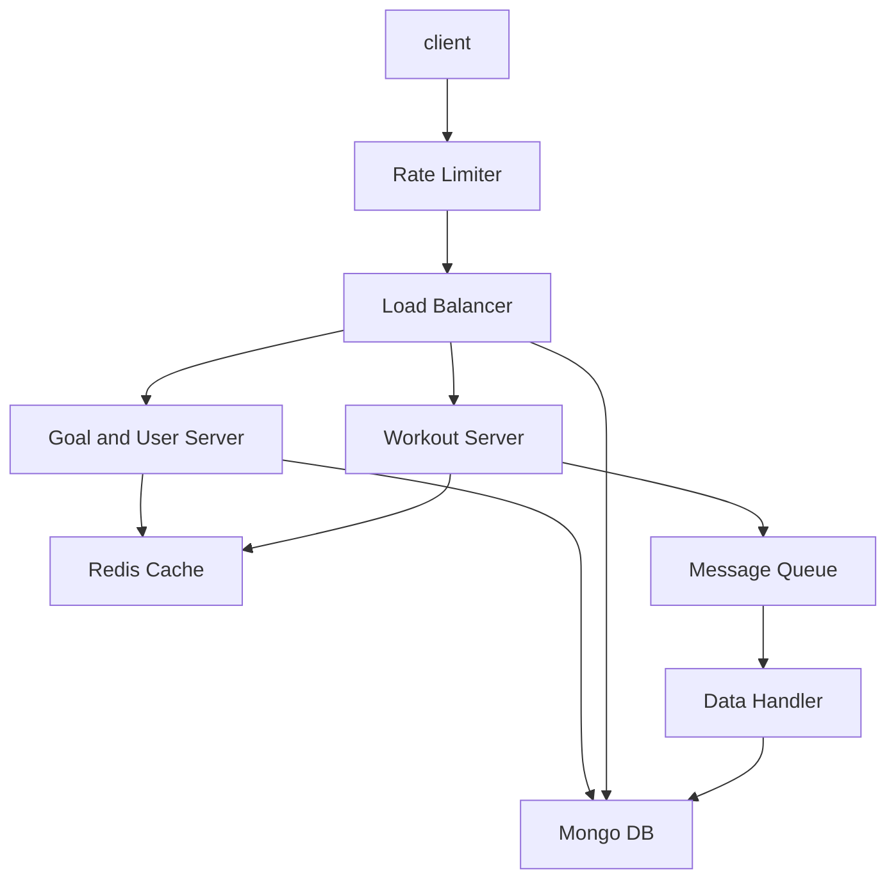

# Fitness Tracking App

## System Requirements
### Functional:
* Client is mobile app on iOS and Android;
* Types of activities are running, walking, cycling and weight lifting;
* Goals are set by frequency (e.g. 3 times a week), duration (e.g. 5 miles per run, 20 miles per bike ride), intensity (100 lbs to lift);

### Non-Functional:
* Scalability: we will shoot for 100M DAU
* Availability: it is important to keep users are able to exercise any time;
* Security and privacy;
* Maintainability: Clear separation of duty and API between client and server, so that we can maintain both sides in the next 5+ years.

Error cases to consider:
* Client becomes out of date;
* GPS stops working;
* User loses phone;
* Datacenter outages.

## Capacity Estimation

100M DAU
peak traffic - 25M requests / sec
Mainly start_workout(), update_progress(), and finish_workout()

Important data types are: workout log and goals.

Workout log is a chronological data:
* Timestamped start of workout
* Timestamped updates to workout
* Timestamped finish of workout

Let's say each line is 32 bytes.
Typical workout is 1 hour and update is made every 5 mins. So that'll be 12 * 32 = 384 bytes. Let's say 1KB per workout considering other metadata.

100M people exercise daily, so that'll generate 1 GB of data each day.

This would make the data size more suitable to NoSQL DB than Relational DB.

The data do not require strong, immediate consistency. MongoDB would be a good choice to store this, give its scalability and schema flexibility.

User metadata and Goals could stored in RDB. But for maintainability, let's use MongoDB for these too.

## API Design

One design question is:

Should client call server for each activity (e.g. user started extercise, made progress during exercise, finished exercise, set goals), or, should it report it only after the whole exercise is finished?

I lean toward the former (client calls server for each activity) because this would make the system more durable. Even if client has a difficulty (e.g. cannot connect to network from the middle of woods, or user loses phone), server would be able to receive data while the client is connected. We should make a robust offline mode, so that the client functions gracefully and maintains information while it cannot connect to server.

Client API:

* **start_workout(user_ID, exercise_type, current_time)**: returns session_ID
* **update_progress(session_ID, progress)**: # progress is JSON object that contains progress information specific to exercise type, e.g. miles run/walked/biked, or number and weight lifted;
* **finish_workout(session_ID)**
* **set_goal(user_ID, goal)** # goal is JSON object that contains goal definition specific to exercise type, e.g. miles run/walked/biked, or number and weight lifted;
* **query_status(user_ID, date_range)**: returns how much extercise, per exercise type, the user has done in the last N days;

## Database Design

Workout Log is a document in MongoDB:
* Workout ID
* User ID
* Timestamp
* Type of event (start workout, progress update, finish workout)
* Progress (e.g. miles run/walked/biked and pace, or number of weights lifted)

Once workout is completed, it would be summarized in Workout Summary document:
* Workout ID
* User ID
* Timestamps of start/finish
* Result(miles run, etc.)

Goal:
* Frequency
* Exercise Type
* Result, which can be:
    * Distance
    * Weight and Number of Repetition

## High-Level Design

We will take microservice approach. Workout Server and Goals & Users are quite different.

Workout Server is write heavy. It requires a large write throughput. Therefore, instead of writing directly to the database, it would push the events information to Message Queue. Data Handler pulls from Message Queue and persists data to the database.

Goals & Users Server is read heavy.



## Request Flows

See the Sequence Diagram.

Client updates Workout Server with start_workout(), update_status(), and finish_workout() calls

Workout Server, via Message Queue and Data Handler, stores the workout log information to the database.

Goal Server, using the data from the database, responds to client's get_status() query with the percentage of the goals achieved, congratulatory messages, etc.

```
sequenceDiagram
Client->>+Workout Server: start_workout()
Workout Server->>+Client: Ack
Client->>+Workout Server: update_status()
Workout Server->>+Client: Ack
Client->>+Workout Server: finish_workout()
Workout Server->>+Client: Ack
Workout Server->>+Database: store workout via Message Queue
Client->>+Goal Server: get_status()
Goal Server->>+Client: goals_status(): % goals achieved, congratulatory messages
```

## Detailed Component Design

An interesting area to dive deeper is data models for different exercise types.

For running / walking / biking / swimming, these are all about distance, so it would have a similar data model, e.g.:

```
{
    "type": "biking",
    "start_time": "2024-4-5 12PM",
    "end_time": "2024-4-5 2PM",
    "distance": 20 miles,
    "location": "See Breeze Park, San Mateo, CA"
}
```

It would be different from weight trainings, e.g.,

```
{
    "type": "weight_training",
    "start_time": "2024-4-5 12PM",
    "end_time": "2024-4-5 2PM",
    "exercises": 
        [
            "type": "dead_lift",
            "weights": [100, 110, 120],
            "repetition": 3,
        ],
    "location": "See Breeze Park, San Mateo, CA"
}
```

Because of this flexibility, I would use JSON format to express this data.

It fits MongoDB's schema flexibility well. 

Workout Server should have plugin software architecture so that developer can add a new plugin to understand new exercise types (e.g., Yoga, CrossFit).

## Trade offs / Tech Choices

The big decision was between RDB and MongoDB.
MongoDB comes on top because:

Pro:
* Scalability: We estimated 1 GB of new data every day. In two years, and with some usage growth, it might reach 1TB of data. MOngoDB's superior scalability would suit this well. 
* Schema Flexibility: As we discussed in Detailed Component Design section, we anticipate the data schema would change, as new types of exercises are added to the system. MongoDB's schema flexibility would suit this well.

Con:
* Because MongoDB has weaker consistency model than RDB, care must be taken. For example, after data is written, it might take some time for all the MongoDB replicas to receive the update (eventual consistency). In this case, the data should not be read before the consistency is achieved.
* Since MongoDB has weaker join capability, application might implement some join functionalities. 

## Failure Scenarios / Bottlenecks
Important failure scenarios are:

Client loses network.

State is maintained in both client and server.

Client keeps track of an exercise session. For example, if a user goes to a one-hour run, it would maintain the status updates (workout starts, distance and pace update every 5 minute, and finish workout). Once the run is completed, the client sends the update to the server. This way, even if the client loses network connection within a session (common scenario if a user is running in a place with weak network signals), it can upload the wholistic view of the session to the server after it regains the connections.

At the same time, client should send periodic update to the server, so that, even if a client faces a steep challenge (e.g. user loses a phone, or the app crashes and damages data), the server would have some information about the workout. This time between updates should be carefully considered to balance the benefit of uploading this information to the server, and the network and computing resources it would consume. 

## Future Improvements
What are some future improments you would make ? How would you mitigate the failure scenario(s) you described above ? 
