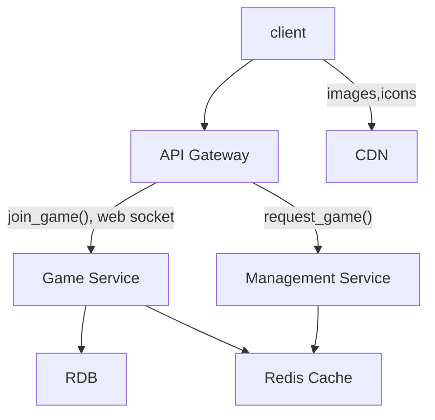

# Online Chess Service

## System Requirements

### Functional
* I will skip user sign up.
* Pair players: User signs up for a time slot and asks to play at a certain level. System finds a matching player and sends an invite links to both players. 
* Move updates: User selects a move on a GUI. System validates the move, updates the player's board, and declares a winner if one player won. 
* For now, I won't consider storing a history of a game. 

### Non-Functional
* Response time is important. After a player makes a move, it should take less than 2 seconds for the other player to see the update; 
* The system should be able to function even if network goes offline for a short amount of time;
* Multiple games can be played. Let's say 1 million games at a peak time. 
* Consistency. It is vital that both players see the same board all the time. 

## Capacity Estimation
Each game can be represented by: 
* 8x8 matrix to present the board;
* Metadata like start time, end time, level;
* Players playing

1KB probably would be sufficient to store these. 

1M games * 1KB = 1GB of data. 

We need to store data for pairing as well:
* Time slot;
* User IDs;
* Level;

These are similarly small. 

Because the data size is small and Consistency is important, I think relational DB makes sense as the primary data store. 

## API Design

* **request_game(user_ID, data_time_slot, level)**: By using this API, a user indicates that they want to play the game, at this time slot, and that level. It does not immediately return game information because there may not be a good match at the time of request. 

When they system finds match, the system schedules a game, and sends a URL link to the two matched players in email. It contains game ID and which game server the users will be connected to. 

* **join_game(user_ID, game_URI)**: game_URI has encoded information for the game ID and the game server they should connect to. 

With in WebSocket connection 

When one player makes a move, client sends the following to the server: 

* **move(user_ID, place, start_location, destination_location)**: The server, after validating the move, sends the board state to the client: 

* **board_state(8 x 8 board representation)**

## Database Design

I will write about critical tables: 

1. **Game**:
* game_id
* board_state # JSON object representing the board
* start_time
* end_time
* winner
* number_of_moves

2. **User**:
* user_id
* name
* email

3. **Game_User**: # this is the join tables which tells us which players are playing which game. 
* game_id
* user_id

4. **Request**:
* user_id
* date_time_slot
* level
* status # already matched or not

A couple of decision point: 

I would represent the board state (8 x 8 matrix of which pieces are where) in JSON format instead of implementing it as a table (e.g. 64 rows representing 64 spaces) because the board state is not used for indexing. This would simplify the data model. 

We could store two user IDs in Game table. This would let us avoid join table. However, doing so would make a common query "list all the games this user played" slow. So I opted for a join table. 

## High-Level Design 

There will be two microservices: 
1. Management Service, which receives requests for a game, creates a game, matches players, and sends notifiction. 
2. Game Service, which connects with clients via WebSocket and executes the game. 

## Request Flows

*Explain how the request flows from end to end in your high level design. Also you could draw a sequence diagram using the diagramming tool to enhance your explanation...*

## Detailed Component Design

Once a player joins the game, there will be a WebSocket connection made between the user's client and the game server.  A couple of tradeoff discussions here: 

## Trade Offs / Tech Choices

Client-service communication during a game can be done by web socket, long polling, or polling. Polling would require too many requests to server and result in long response time. Both web socket or long polloing would work, as they both give short response time and conserve resources on the servers. Long Polling requires more requests than web socket, because it needs to reconnect once in a while. Web Socket consumes more memory than long polling. I would first try web socket, measure memory and performance, and confirm it is a good approach, or we should try long polling. 

Redis cache is employed to store oft-require data (e.g. rows in Game table) can be accessed quickly by microservices. Also, it would be beneficial to back up websocket connection for fault tolerance. 

* **Move validation**
When a move is made by Player 1, the client calls move (piece, start_location, destination_location) message via WebSocket.

Game Service makes sure this move is legal (each piece has a set of moves that are allowed). Because we know the piece, the sytem would be able to determine this legality. If the move is illegal, return an error. If the move is legal, the system updates the board state, and send it to the clients. 

## Failure Scenarios / Bottlenecks

When a client of a player (let's say Player 1) becomes offline from the server for a short amount of time, we'd like to make sure the players can keep playing. 

Player 1 can still view the board and make a move. To do so, the client has to store the board state (8 x 8 board) and store the move the player makes. 
Once the network (therefore the WebSocket connection) is re-established, the last move is propagated to Player 2's client.

Matching players is an interesting question. 

Straightforward case is: If Player 1 and Player 2 pick the same time slot and they want to play at the same level, simply match the two. 

But if Player 1 wants to play at a certain level (say 5), but if no matching Player showed up in time (let's say until 5 minutes before the game), we would expand the level criteria (e.g. maybe level 4-6 would be acceptable). I would imagine most players want to play, even against a player with slightly different level. 

## Future Improvement
*What are some future improvements you would make? How would you mitigate the failure scenario(s) you described above?*

