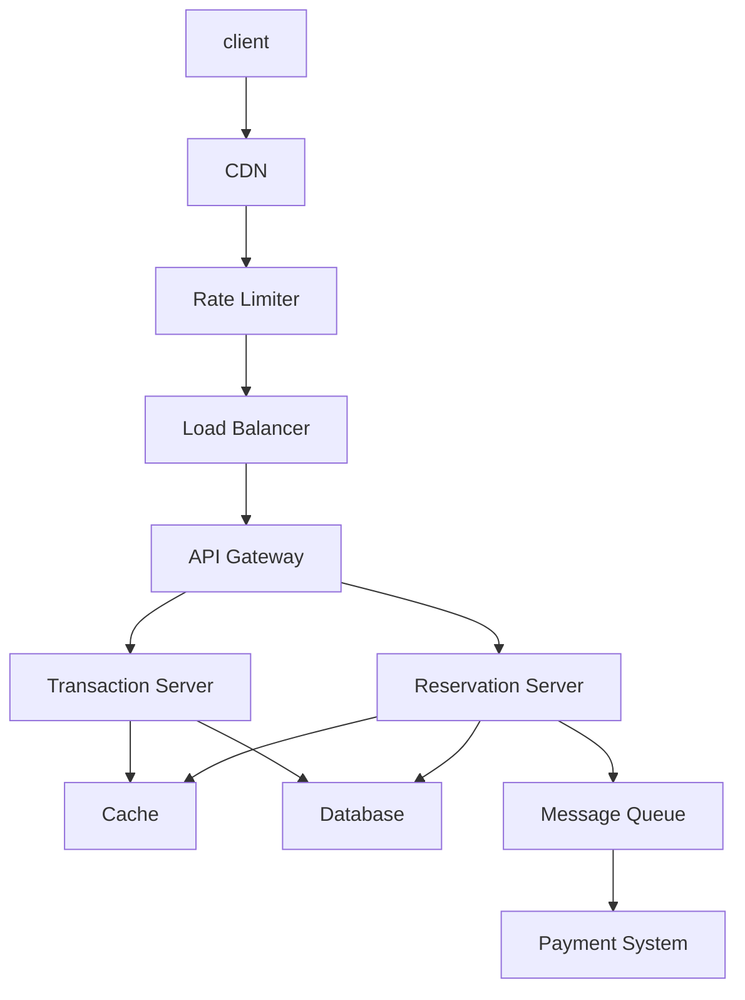

# ParkingLog
## System Requirements
### Functional:
1. User can reserve a parking spot;
2. User pays for the reservation;
3. User can park a car on the parking spot;
4. User can leave before the reservation time expires;
5. There are three different parking spots - compact size, standard size, and the electric charger;
6. One common error case to handle is when a user makes a reservation, but fails to show up. In this case, we would charge for the first 24 hours.

### Non-functional:
1. Scalability: we are designing this for an international company who has 1000s of parking lots across nations;
2. Availability;
3. Consistency: once a reservation is made, the parking spot must be available for the user. No double-booking.

There can be other considerations, e.g. indoor parking vs. outdoor parking, additional services like car wash, and parking cars near the entrance to have a quick enter & exist experience. But for now, I'd like to foces on the requirements I listed above.

## Capacity Estimation
I assume:
* The company has operations in 10 countries;
* The company has 100 parking lots, on average, in one country;
* On average, each parking lot has a capacity of 200 cars. 70% standard cars. 20% compact cars. 10% electric cars with chargers.
* 80% of users use it for short term parking, averaging 4 hours;
* 20% of users use it for long term parking, averaging 5 days;
* For each parking lot, there are on average 50 reservation requests per day.

Estimation:
* 10 * 100 = 1000 parking lots;
* For each day, this system will receive 50,000 reservation requests per day;
* Each reservation would mainly consists of:
    * User ID (20 bytes)
    * Car type (1 byte)
    * Reservation start time (8 bytes)
    * Reservation end time (8 bytes)
    * Roughly totaling 40 bytes
* Each day, we would add 400KB of data;
* In 2 years, it would add up to 292MB.

This estimate leads me to choose a relational database as the storage for reservations. The estimated size is within RDB's limits. RDB also gives strong consistency guarantee, which is suitable for a reservation system because avoiding inconsistency (e.g. double booking) is an important requirement. The response time requirement is not very hard. If reservation takes a couple of seconds (instead of milliseconds), that would be acceptable.

## API Design

APIs used by users:
* **check_capacity(lot_ID, vehicle_type, start_date_time, end_date_time):** returns the number of open spots in the given parking lot. It also returns the price.
* **reserve_spot(user_ID, lot_ID, vehicle_type, start_date_time, end_date_time):** it returns the reservation ID and the price.
* **pay(user_ID, reservation_ID)**

APIs used by gate checking service at the parking lot:
* **vehicle_arrived(reservation_ID, date_time)**
* **vehicle_left(reservation_ID, date_time)**

## Database Design

Reservation table:
* reservation_ID (primary key)
* lot_ID (foreign key)
* user_ID (foreign key)
* start_time
* end_time
* vehicle_type (foreign key)
* payment_status (paid, unpaid, canceled)
* completion_status (to be completed, fulfilled, canceled)

Vehicle_type table:
* vehicle_type

Lot table:
* lot_ID (primary key)
* contact_info_ID (foreign key)
* Lot_Space_ID (foreign key to Lot_Space table)
* capacities (foreign key to Lot_Capacity table)

Contact_Info table:
* contact_info_ID (primary key)
* contact_type
* contact_value

User table:
* user_ID (primary key)
* contact_info_ID (foreign key)
* vehicle (foreign key to Vehicle_type table)

Transaction table:
* Transaction_ID (primary key)
* user_ID (foreign key)
* vehicle_ID (foreign key)
* check_in_date_time
* check_out_date_time

There can be enhancements, e.g. reviews for the parking lot, and reviews for the users. But for now, I will focus on the tables above.

## High-level Design

CDN caches static contents for high performance.
Rate Limiter protects the service from DOS attacks.
Load Balancer distributes requests to App Servers using weighted round robin algorithm.

As dicussed above, RDB is used as the data store.
App Server uses Redis Cache for performance gain.



## Request Flows
check_capacity() is handled by Reservation Server consulting the data in the database.

reserve_spot is handled by Reservation Server, which creates a new entry in Reservation table.
It would create a request for payment, which is queued by Message Queue and submitted to the external Payment System.

reserve_spot() may fail if multiple users are trying to book the same spot. Return an error and ask the client to try calling reserve_spot() again.
It would also fail if the lot is full. In that case, the client should not retry. Reservation Server may return helpful informantion such as estimated time spots may open up in the future.

vehicle_arrived() and vehicle_left() are handled by Transaction Server, which modifies the Transaction table to keep track of vehicle checkins and checkouts.
If vehicle does not arrive after some number of hours (e.g. 24 hours), reservation would be canceled. The user would be charged for 1 day of payment.

If inconsistent state happens, e.g. vehicle_left() is called before corresponding vehicle_arrived(), administrator at the lot should be notified. The service would assume the vehicle arrived around the corresponding reservation start time.

```
sequenceDiagram
Client->>+Reservation Server: reserve_spot()
Reservation Server->>+Client: reservation_ID, price
Client->>+Reservation Server: pay()
Reservation Server->>+Payment System: Payment Request
Payment System ->>+ Reservation Server: Payment Result
Parking Lot ->>+ Transaction Server: vehicle_arrived()
Parking Lot ->>+ Transaction Server: vehicle_left()
```

## Detailed Component Design

See Sequence Diagram. It depicts how messages flow for client to make a reservation and pay for it, and for the parking lot system to notify the Transaction System when the user's vehicle arrives and leaves.

One important algorithm is how to find an open spot when reserve_spot() call is made.

To support this functionality, we would chop 24 hours into 15 minutes. One day would be represented by 96 slots. Since we just need to store occupied / unoccupied, we can use one bit to represent the 15 minute slot. 1 spot requires 96 bits per day. 35040 bits (~4KB) per day.

When reserve_spot(start_time, end_time) is called, the algorithm would be:
1. Convert start_time and end_time into index. For example, 00:00 on Jan 1st would be index 0. 00:15 would be index 1, and so on;
2. Create a bitmap with 1's representing time between start_time and end_time;
3. Compare this bitmap to the bitmaps representing occupied time of parking spots. Scan from parking spot 0 (closest to entrance) to N (farthest from the entrance);

This algorithm would find the closest parking spot that is available for the desired time slot.

Because this search is bound by the number of parking slots (100s) and the granularity of reservation (15 mins), it would be performant enough.

It would probably be possible to use Interval Tree data structure to optimize this algorithm further, if further optimization is required.

## Trade offs / Tech Choices

The biggest decision point was the database. For this service, I chose Relational Database over NoSQL Database. The data size, estimated at increasing ~300MB in 2 years, is well within the capacity of a RDB. RDB provides strong consistency, which is beneficial for a reservation service. Once a reservation is made, the user needs the system to honor it 100%, without the risk of double booking or a reservation mistakingly deleted.

NoSQL database, for example MongoDB, would provide a better horizontal scalability than RDB. But for this service, I decided the benefit of RDB outweighs that of NoSQL DB. 

## Failure Scenarios / Bottlenecks

One bottleneck scenario is when a large number of people gather in a place near one of the parking lots, e.g. for Olympics Games.

That would put a burden on the reservation work flow (reserve_spot(), pay()). Transaction Server would be fine, as the number of requrest to Transaction Server would be limited by the physical limitation of the parking lots (i.e. how many spots they have).

To prepare for such an event, all the software components must be replicated horizontally to have enough capacity. Rate Limits have to be configured to smooth out extreme level of traffic.

The database tables must be replicated in multiple ways (e.g. a copy within data center, a copy in another data center, a copy in a different region) for fault tolerance and disaster recovery.

Monitoring system must be put in place to monitor the health of all the servers and commponnents.

## Future Improvements

I think this builds a foundation for more feature development in the future, e.g. additional services, more vehicle and parking types (very large vehicles, buses and trucks, motorcycles and bicycles, charging stations). 

Optimizations and availablity improvement based on geographic locations would be a good area to invest further. For example, using Global Load Balancer so that clients get routed to the closest data center. Replicating databases between different geographic locations as a back up mechanism in case of regional disaster. 


