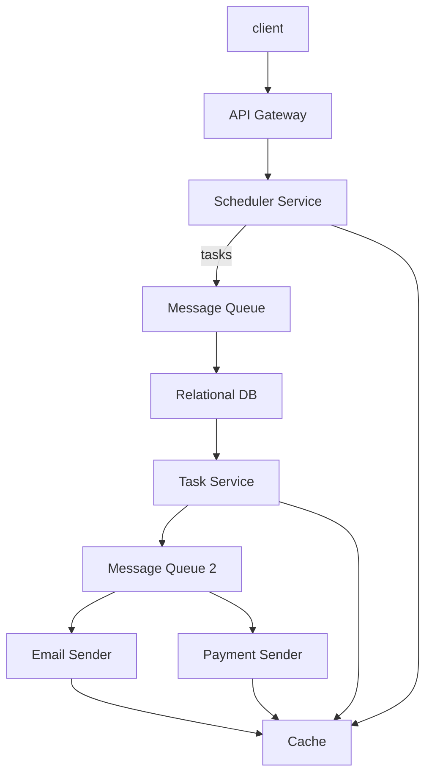

# Task Scheduler

## System Requirements
### Functional:
* User can schedule a one-off task or recurring task;
* Examples of tasks are: send notification email, transfer money, run a report and sent the result

### Non-Functional: 
* Reliable
* Low Response Time
* Scalable: 1000s of tasks executed at once

## Capacity Estimation
* 100K DAU
* 100 tasks per day per user
* 10M tasks / day
* 1KB storage for each event, 10GB storage
* Let's say 1GB is added every day. 730GB in 2 years. 

## API Design
* **schedule_task(user_id, date_time, type, metadata)**: return event_id
* **cancel_task(user_id, event_id)**
* **update_task(user_id, event_id, date_time, type, metadata)**

## Database Design
* Storage is within the range that fits RDB. 
* Consistency is important because we want to execute accurate events. 
* Main storage should RDB. 

- Data Model:

1. **Task Table**:
* task_id
* user_id
* execute_datetime # in seconds
* recurring_period # in seconds
* type # email, payment, report

Normalization gives better consistency, e.g., if user wants to change payment amount across the board. 

Many-to-one from Payment, Notification tables to Task table. 

2. **Payment Table**:
* user_id
* task_id
* sender
* receiver
* amount

3. **Notification Table**:
* user_id
* task_id
* sender
* receiver
* message

## High-Level Design
* Scheduler Service stores tasks in RDB. 
* Task Runner reads from RDB and creates events in Message Queue. 
* Email Sender and Payment Sender reads from this queue and takes actions. 

## Request Flows
*Explain how the request flows from end to end in your high level design. Also you could draw a sequence diagram using the diagramming tool to enhance your explanation...*

## Detailed Component Design

* Initiate tasks at the right time. 
I would imagine a message queue has a functionality to run task at a certain time. 

If there is no such functionality, I would implement it using a topic. 

I can create a topic that runs at a certain time, e.g., May 1st, 9:00AM PDT. 

Task handlers such as Email Sender or Payment Sender subscribes to this topic and execute tasks. 

* Monitor all components for response time and resource situation. 
* For example, if Email Sender or Payment Sender lags behind, notify sysadmin immediately. 

## Trade-offs / Tech Choices
We chose Relational DB as the main storage for tasks. 

Storage size is within the range that fits RDB. 

Consistency is important because we want to execute accurate events. 

Main storage should be RDB. 

NoSQL DB give better scalability. However, consistency is the strength of RDB. 

RDB cannot scale horizontally. Therefore, we need to partition data by user_id. This gives good locality, e.g., if user sends 1,000 events, metadata can be read from cache. 

## Failure Scenarios / Bottlenecks
* Notification or Payment fails. Retry N times using Message Queue. After that, notify the user of failure. 
* Payment does not go through for the lack of fund or authorization. Cancel event and inform the user. 
* RDB cannot scale. Partition data by user_id. This gives good locality, e.g., if user sends 1,000 events, metadata can be read from cache. 

## Future Improvements
*What are some future improvements you would make? How would you mitigate the failure scenario(s) you described above?*
