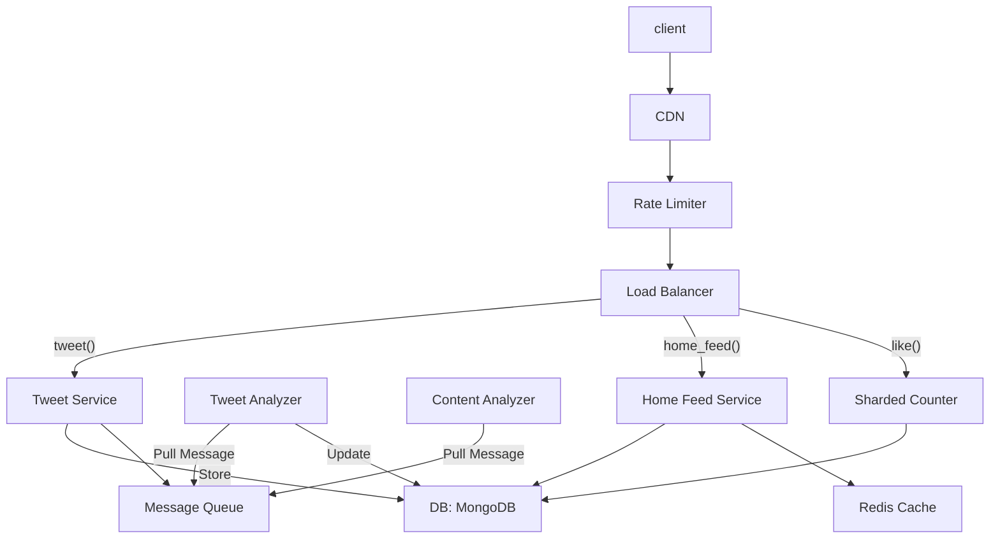

# Twitter

## System Requirements
### Functional
* User can tweet (send) up to 140 character message.
* User can follow other users.
* User can like other users' tweets.
* User's home feed will show tweets from the users they are following.
* The feed will show top K popular tweets, based on the number of likes they receive, and the number of the followers the author has.

If I have time, I will do retweeting.

### Non-Functional
* Scalability: it will have to serve a very large population, e.g. 500M DAU.
* Response time: user has to see tweets quickly. When user opens home feed, the first 10 tweets should show up within 500ms.
* Consistency requirement can be a little bit relaxed. It does not require strong Consistency like banking transactions. Eventual consistency would suffice. For example, if a user tweets something. If a user in the same geographic region sees the tweet in 1 second, and another user on the other side of the earth sees it after 30 s, that would be acceptable.
* Security, content moderation, and anti-abuse protection are all important, but I'll not focus on them in this exercise due to lack of time. I will come back to them if I have time.

## Capacity Estimation

500M DAU
Each user, on average, tweets twice a day. 1B tweets / day.
Each user, on average, views 100 tweets a day.

At peak, this system should scale up to 20% of DAU - 100M users - interacting with the system.

I will think about storage capacity first.

1B tweets a day. Each tweet is 140 chars. Considering international encoding and metadata, it seems reasonable to assume each message takes up to 512 bytes.

So this data increases by 512GB every day. In two years, it would be 365 TB.

This goes beyond the typical capacity of RDB. So we'll pick a NoSQL DB.

A document based NoSQL DB, e.g. MongoDB, seems like a good candidate. It is more scalable than RDBs. It has schema flexibility, which allows future enhancements of the application.

The data model would look something like:

Tweet document:
* **tweet_ID**: primary key
* **created_by**: user ID
* **posted_time**
* **content**
* **medialink**: link to picture or video content
* **number_of_likes**
* **hashtags**: list of hashtag strings used in the tweet.
* **users_mentioned**: list of users mentioned in the tweet

User:
* **user_ID**: primary key
* **email**
* **name**
* **nickname**
* **DOB**
* **gender**

Bottleneck analysis:
1. in this data model, number_of_likes seems to be a challenge to me. If a famous person posts something, and millions of users click "Like" button within one minute, it would overwhelm this document of this database.
One approach to overcome this is to break up this into multiple (let's say 100) sub-counters, and make different DB nodes be responsible for each sub-counter. I will come back to this if I have time.

2. Another important bottleneck is when a user with millions of followers (e.g. famous people) tweets something, the tweet should show up on million of users' home feed. I will look into this deeper in DB design section.
They should also receive notifications, but I will punt notifications in this particular exercise.
I will consider concurrency in later sections: millions of users viewing the same message concurrency, tweeting messages with the same hash tag, etc.

## API Design

* tweet(user_ID, content)
    User represented by user_ID tweets this content.
    The content will be parsed by the server side for users and hashtags mentioned.

* follow(follower, followed)
    User represented by follower user ID will follow user represented by followed user ID.

* like(user_ID, tweet_ID)
    User represented by the user_ID likes the tweet represented by tweet_ID.

* home_feed(user_ID, offset, number)
    Returns JSON document containing tweets that should be shown on the user's home feed.
    offset represents where in the list of top tweets it should start from.
    number represents the number of tweets this API requests.
    For example, when a user first opens their home feed, it would be from offset 0. It is important for this API to respond quickly, so it would be advisable to keep number relatively small - for instance, 5 or 10 for a mobile app client. After the initial 5 or 10 tweets are shown to the user, the client can request more, potentially in the background, to prepare for more feeds in case user scrolls to home feed.

Error handling would follow HTTP error code. For example, 4XX for client side error (e.g. liking a tweet ID that does not exist), 5XX for server side error (e.g. bug causing some of the APIs to fail). It would be important for client to handle too many requests error (429) correctly. For example, if home_feed() API returns 429, it would indicate the servers are too busy to service this potentially expensive call. Therefore, it would be advisable for the client to wait for some time (say seconds) before calling this again.

Future direction: for a more dynamic content update (e.g. home feed), it might be helpful to consider a WebSocket based API for the client to receive real time update from the service. I will not focus on this for now, but may come back if I have time.

## Database Design

I chose MongoDB as the main database for its scalability and schema flexibility.
These are the data models.

Tweet document:
* **tweet_ID**: primary key
* **created_by**: user ID
* **posted_time**: index
* **content**
* **medialink**: link to picture or video content
* **number_of_likes**

User:
* **user_ID**: primary key
* **email**: index
* **name**
* **nickname**
* **DOB**
* **gender**: index

Hashtag:
* **hashtag_ID**: primary key
* **hashtag**: the hashtag string
* **tweets**: tweet_IDs who have this hashtag.

UserMentioned:
* **user_ID**: the user that is mentioned
* **array of tweet_ID**: the tweets that mentions the user

I decided to take Hashtag is a separate document from Tweet document because the main functionality we want to implement efficiently is the mapping from hash tag to tweets (e.g. to display tags with this hash tag), instead of the other way around.

I decided to create UserMentioned document, which stores tweet IDs that mention a user, separate from the User document. A user (e.g. famous person) can be mentioned by many tweets in a short amount of time. If I store the mentions in the User document, we would have to load and save the User Document every single time. That seems redundant.

User.number_of_likes would have a scalability challenge. When a famous person tweets, it'd be possible millions of users would press the Like button. This would create the Tweet document a hot spot. To avoid this, I would create a sharded counter service for users with more than, e.g., 1000 followers. For such users, the sharded counter service would do the counting, using multiple (let's say 100) sub-counters, stored in a high performance key-value store like Redis Cache. Once in a while (say every 5 min or so), the service would write the number_of_likes in Tweet document.

Follows:
* **follower**: user_ID of the user who is following
* **followed**: user_ID of the user being followed
* **timestamp**:

Follows document borrows a concept of normalization from RDB. By having this document separated from User document, we can query the follows relationship in both ways efficiently: (1) given a user, list all the users they are following, and (2) given a user, list all the users who are following them.

## High-Level Design

CDN would be important to cache static contents that are written once and read many times. For example, images and videos posted by a user.

Rate Limiter protects all the backend servers from Denial of Service attack, intentional or unintentional.

Tweet Service's job is to receive new tweets from the client. It saves them in Tweet DB. It also creates a message in Message Queue, which initiates some async actions.

Tweet Analyzer pulls a message from the Message Queue. It analyzes the tweet and takes appropriate actions, e.g. extract hashtags and user mentions and update appropriate database. We would need another, similar service for content filtering.

Home Feed service constructs a list of tweets that are recommended for the user, and returns the list in JSON format.

I expect creating and viewing would show strong locality. For example, a tweet in Japanese language, made by a user in Japan, would be viewed mostly from Japan region. For this reason, it would be beneficial in terms of scalability to shard data and store them at an appropriate datacenter. Sharing by user ID seems reasonable.

Data should be replicated among data centers, too, for greater fault tolerance.

## Request Flows
*Explain how the request flows from end to end in your high level design. Also, you could draw a sequence diagram using the diagram using the diagramming tool to enhance your explanation...*

## Detailed Component Design

Home Feed Service essentially recommends K most interesting tweets for a given user. 

Score of Tweet = weight_like * number_of_likes + weight_followers * number of followers on the tweets's author + weight_retweet * number_of_retweets.

Home Feed Service would implement top-k algorightm based on a heap data structure, which is a tree which can be used to guarantee that the root item has the highest score. 

Home Feed Service would compute top K tweets for a given user, and stores them in cache. Since the recommendattion changes in real time, the main storage for the recommendation (list of tweets) should be cache (instad of database). Redis Cache can persist the data in a file, if it is desireable. 

## Trade Offs / Tech Choices

Datapath choice for this service is an interesting decision. 

If I picked RDB for tweets, it would give us strong consistency. However, it would struggle to scale in terms of size (estimated to be 365TB in two years).

If I picked a wide-column database like Cassandra, scalability would even be better than MongoDB. However, the schema would be rigid, making feature enhancements difficult. 

MongoDB strikes the right balance - advantage in scalability and performance over RDB, while maintaining advantage such as schema flexibility and normalization than wide column DB.

## Failure Scenarios / Bottlenecks

Scalability challenge scenario 1 - If a famous person posts something, and millions of users click "Like" button within one minute, it would overwhelm this document of this database. I introduced Sharded Counter service, which uses multiple sub-counters to count likes (and dislikes) in a scalable fashion, and writes the aggregated number to the DB.

Scalability challenge scenario 2 - When a user with millions of followers (e.g. famous people) tweets something, the tweet show up on million of users' home feed. Tweet Analyzer may overwhelm the DB if it natively tries to write into millions of documents in the DB. It may be better to create a new document that stores recent tweets from famous people. Home Feed Service can pull information from this document and synthesize the information into the tweets list it returns to the client.

## Future Improvments

*What are some future improvements you would like? How would you mitigate the failure scenario(s) you described above?*
