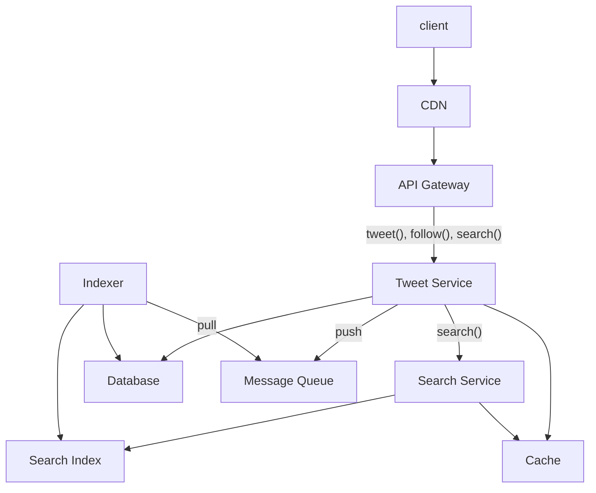

# Twitter Search

## System Requirements

### Functional:
* User can tweet
* Search tweets by text. Search team can be one word, or multiple words. Multiple words would be considered with "and";
* User can follow other users. Search result should prioritize tweets from the users being followed;

For now, I will ignore other features like follows, comments. I'll come back to it if I have time.

### Non-Functional:

* Availability - It is a global service and should always be available;
* Response time - Each search should return results in 500 ms;
* Scalability - It's a massive service. Let's assme 500 M DAU and 250 M searches submitted every day;
* Fault-tolerance - In a distributed system, many things will fail, e.g., storage for search index may fail, network may experience errors. Tweets must not be lost so should be backed up safely. Search index can be re-=generated, but with great cost, so this should be backed up too;
* Privacy - Who is searching what search terms should not be revealed;
* Consistency - I think it is acceptable to relax consistency requirement compared to ACID properties. For example, a user who is in the other side of the globe from the author of a tweet may not see this tweet in search for minutes. That is acceptable.

Edge case to consider:
* A famous person tweets. We'd like to make sure this tweet shows up in everyone's search after a short amount of time.

## Capacity Estimation

* 500M DAU
* 250M searches daily
* At peak, 50M search requests / s
* 1B tweets per day
* Each tweet takes 1KB of storage, including content and metadata
* 1TB data / day
* 0.7PB in 2 years. With user growth and some excess capacity, we should plan for 1PB in 2 years.

The main things we need to worry about storing is tweets. Due to the size of data (1PB in 2 years), I think a NoSQL DB is more suitable than Relational DB to store the tweets. NoSQL DBs scale better horizonally. RDB has an advantage of NoSQL for strong consistency (e.g. ACID properties), but this it not necessary for this aaplication.

Among NoSQL DBs, wide column DB such as Cassandra seems to be a good fit. It is horizontally scalable. It is optimized for write throughput. With 1B tweets a day, this system requires high write throughput.

Argument for a document DBs like MongoDB would be its schema flexibility and secondary index, which would make future applicaiton enhancements easier. But I lean toward wide column DB because write external DBs, to store index.

Both original tweets and search index must be partitioned and backed up. Primary thoughts would be:
* Geo localed CDNs and data centers should be used to provide short response time for users;
* Geo location should be used to guide which data should be stored where;
* Generally speaking, data should have two backup copies: one in the same data center, another in a different geographic region.

## API Design

* **tweet(user_ID, text)**: Application calls this when a user tweets.
* **follow(follower_ID, followed_user_ID)**: User (with follower_ID) follows another user (followed_user_ID). I think it is OK for this API to take only one user, as I think it's rare for a user to want to follow many users at the same time.
* **search(user_ID, start, number, criteria)**: User searches for the search term in "term". The term can be single word or multi words. In case of multi words, it would be considered with "and" logic.

In a addition to term, this API can specifies start and the number of tweets to be returned. For example, even if search can ultimately return 1,000 tweets, application might just want first ten, or the next ten, to whoe the first ten tweets quickly.

This API can also take search criteria, e.g., prioritizing users the user is following, prioritizing tweets from popular people, or new tweets, and so on.

## Database Design
Primary Data model is Tweets:

**Tweet**:
* tweet_ID (primary key)
* user_ID (reference to user who write this tweet)
* content (text content of the tweet)
* timestamp (when was it tweeted)
* geo location
* language
* users_mentioned (users users_mentioned in this tweet)
* hashtags (hash tags mentioned in this tweet)
* media links (links to image and videos)

Some of the information, e.g., geo location and language, are helpful to decide where it should be stored. For example, a tweet in Japanese language made in Japan should be stored primarily in Japan (with backup in other places).

Partitioning (aka sharding) would be critical because we store a massive number of tweets, and the number will keep growing.

I think important candidates for partitioning keys are tweet ID, user ID, and geo location.

I lean toward using user ID and geo location as composite partitioning key because:
* I think a lot of searches would involve a user, e.g., what this celebrity tweeted recently. As such, it would be beneficial if tweets from the same user stay close, e.g., one DB node, or DB nodes in one data center.
* Geo location would be important in keeping the data close to the clients. For example, users in a certain country would have a strong tendency to want to view tweets by other users in the same country.
* Useing tweet_ID (or a hash of tweet_ID) as a primary key has the benefit of more even distribution. In contrast, (user_ID, geo location) has a challenge because some users tweet a lot more than other users.
* To counter this challenge, dynamic partitioning can be used. Basically, if one partition has too much data in it, it can be split and be distributed across DB nodes. I believe Cassandra supports this feature with consistent hashing.
* Another challenge of user_ID based partitioning is some users would become a hot key (accessed a lot). It is important that frequently viewed tweets from popular users would stay in Cache, so that the DB node does not have to be accessed excessively. Cache (e.g., Redis Cache) with LRU eviction policy can achieve this.

In terms of durability, it is unacceptable to lose tweets data. It is less catastrophic to lose inverted search index because we can rebuild it. But to index huge amount (Petabytes) of tweets data takes a long time. Therefore, it is essential to plan backup and fault tolerance strategy for both types of data - tweets and search index.

We will rely heavily on geographically diverse data centers for user response time and scalability. We will have a data center close to users. We will take advantage of these data centers for fault tolerance.

Data (tweets and index) should be backed up in at least 3 data centers. When a client has to write (e.g. to tweet), it would send this request to the closest data center. A Cassandra node in this DC would replicate the data to replicas within the DC, as well as replicas in other DCs. We would configure consistency level to balance consistency and response time. Perhaps making sure two other replicas within a data center have the new data may be a good compromise performance (because only two replicas have to acknowledge it) and durability (because we know two backup copies exist, which will be copied to other DCs asynchronously).

## High-Level Design

frequently accessed contents, such tweets from popular users, images and videos, are cached in CDN, in a geo location close to large populartion of users, for quick access.

API Gateway rate-limits requests to prevent Denial of Service attacks and smooth out surge of request beyond expected level.

I split app server into Tweet Service and Search Service because these two are very different. The former takes a client request and interacts with database. Search Service takes search request from Tweet Service. It can be 3rd party solution such as Solr or Elastic Search.

When Tweet Service receives a tweet, it stores the message in DB. At the same time, it creates a message in Message Queue like Kafka. Indexer pulls this message, reads tweet text, and creates index. Indexer also extracts hashtags and users mentioned.

Cache is used to spped up access throughout services.

Because we will have data centers in multiple geographic regions, we will have two levels of load balancers - global and local. Global Load Balancer takes care of failover scenario. If one geo region does not have enough capacity, e.g., because of the data centers has a catastropic accident, the Global Load Balancer would shift traffic away from this region.

Local Load Balancer (included within API gateway in the high level diagram) distributes traffic within a data center to maximize resource utilization.



## Request Flows

*Explain how the request flows from end to end in your high level design. Also you could draw a sequence diagram using the diagramming tool to enhance your explanation...*

## Detailed Component Design

Let's dig deeper into search.

Tweet search is implemented by two distint processes:

First one is Indexer. It's a streaming process. A message in the message queue would notifier the Indexer that a new tweet arrived. When it receives the message, it reads the tweet from the database, creates an inverted index (i.e. hash map which points from search words to documents). I assume Indexer does this by calling Lucene or Solr library. It then adds the new index to Search Index.

Search Index is a sharded data store. Solr has its own native data store, so we will use it to store the index (instead of an external database).

The second part is when a user searches for search terms. Tweet Service forwards the search query to Search Service, which is most likely a third party search service like Solr or Elastic Search. This will use the inverted index stored in Search Index.

For scalability and response time, Search Index should be sharded. We should be able to use languages and geographic locations as high level shard keys.

Beyond that, a simple approach of using tweet ID as a shard key might be fine. Each shard would be responsible for a range of tweet IDs. This would probably be better than sharding by user IDs, because some users are a lot more active than other users.

For storing data, Geo location would be okay.

Generally speaking, wherever request comes from should be where the tweets and media files should be stored and served from.

A notable exception would be a tweet from a famous people. An international star (e.g. a celebrity)'s tweets are viewed from all across the world. Therefore, it would be important for the system (in this system, it would be Indexer's job) to detect such a tweet, and make sure the tweet (including images and videos) will be stored in database and CDNs of all geo locations.

***

To make sure search occurs quickly, Cache (e.g. Redis Cache) plays an important role. When Tweet Service receives a search query, it first checks Cache if the same or similar search terms were queried. Cache remembers commonly used search terms, e.g. "Beyonce", "Super Bowl Ad". For these terms, Cache can quickly return the search result, without using Search Service, greatly enhancing user response time and scalability. Cache can remember a whole object that would be returned:

```
{
    "tweet_ID": ...,
    "content": ...,
    "timestamp": ...,
    number_of_likes: ...,
    media_links: ...,
    hashtags: ...,
}
```

and so on. When there are too many objects in Cache, it would evict old objects in an algorigthm similar to LRU (least recently used). It would be expensive to implement a perfect LRU policy, so cache services like Redis and Memcached implement approximate policy to LRU. We can use that.

## Trade-offs / Tech Choices

*Explain any trade offs you have made and why you made certain tech choices...*

## Failure Scenarios / Bottlenecks

*Try to discuss as many failure scenarios/bottlenecks as possible.*

## Future Improvements

*What are some future improvements you would make? How would you mitigate the failure scenario(s) you described above?*
