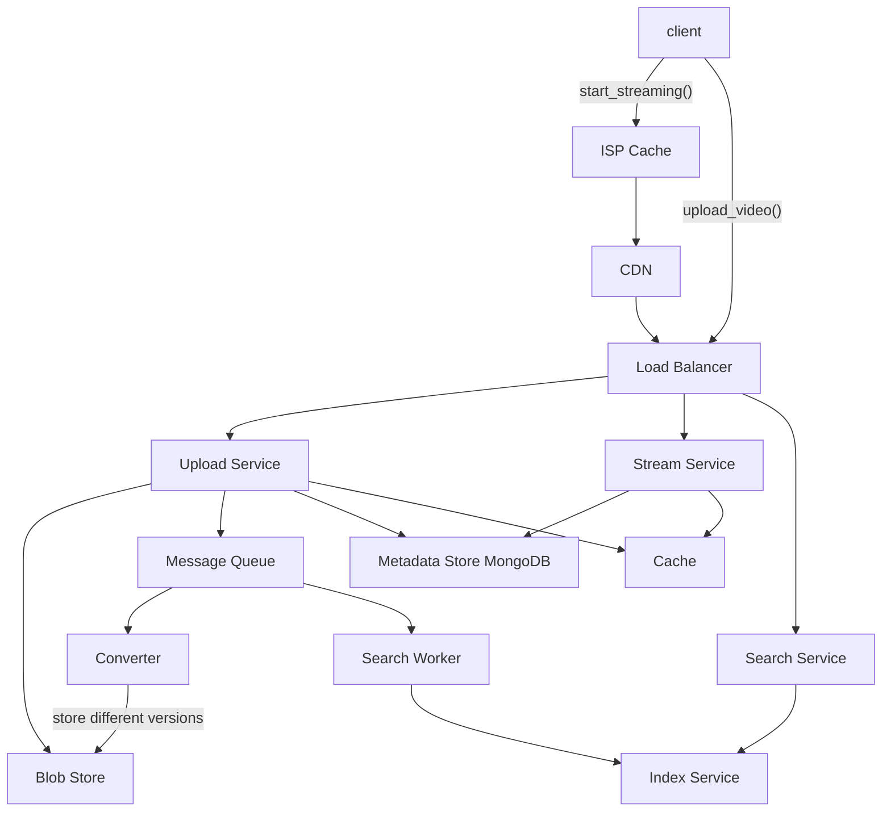

# Youtube or Netflix

## System Requirements
### Functional

* User can upload a video;
* User can delete a video;
* User can watch a video (that was previously uploaded);
* User can search for a video using a text search.

### Non-Functional

* Availability: It is a world wide service. It is expected to be always on. Otherwise, users will go to other services;
* Response Time: It is important for watching and searching have short response time, e.g. less than half a second;
* No buffering;
* Scalability: We expect ever increasing of users, videos, and views;
* We can relax a little on consistency. Unlike, let's say a bank transaction system, it would be OK to take some time to make an uploaded video available for viewing;
* Client diversity: It is important that the service works well for clients with different characteristics -screen size and resolution, computational power, and network bandwidth.

Main error cases to consider:
1. Network failure interrupts uploading a large video, causing a failure;
2. Network failure interruptes viewing.

## Capacity Estimation

* 500M DAU
* 1% of users upload videos.
* Average user watches 5 videos per day.
* Peak load ~ 20% of users access it at the same second. So that's 100M requests per second.
* Average length of a video is 5 minutes. It would take 50MB of space to store.
* But there will be videos much longer (e.g. 2 hours).

**Storage space:**
* 50MB * 5M users * 1/7 (user uploads one video per week) = 36TB / day
* In two years, it would Requirements 13PB of storage.

Some conclusions we can draw from the estimation are:
1. To store the videos, we would need a blob store (e.g. Amazon S3);
2. The access pattern would be read heavy. Write once, and read many times.
3. To maintain response time, we must cache the videos in a place close to the clients. For example, cache colocated at Internet Service Provider, and IXP. It would also be important to have CDNs at major geographic locations, and cache the videos there, too.
4. Video data should be replicated in multiple data centers for fault tolerance and read throughput.

## API Design

Video should be split into multiple chunks for upload and download. This makes retries and parallelization easier. The API should account for this.

**upload_video(user_ID, content, offset, size, tags)**: This API uploads one chunk of video. The chunk is represented by offset (is it the first chunk, second chunk, ...) and size.

** start_streaming(user_ID, video_ID, ofset, resolution, format, quality)**: This API downloads initiates video streaming, using a streaming protocol such as DASH or HLS.

Depending on the client type and environment it's in, this API lets the client to choose different chunks - resolution, encoding format, and quality. For example, if the client is a high powered laptop with a good internet connection and is experiencing a high bit rate with the service, it would choose for high resolution and high quality.

I will not go into the API that is used within the HLS / DASH protocol, because it is standardized.

**delete_video(user_ID, video_ID)**:

**search_video(user_ID, filters, search_text)**: This API returns a list of video IDs, sorted by how closely it matches the search. It can take filters such as length and language.

All APIs return HTTP error code, e.g. 4XX for user errors like unauthorized attempt, or 5XX for system errors. It can also time out (e.g. after waiting for 1 minute).

## Database Design

The original video files will be stored in blob store.

In addition, different versions of the video (different encoding methods at a different bit rate) will be generated and also stored in blob store.

Meta data like tags on the video, name, date, number of views, and users, would be stored in MongoDB. Mongo's JSON like document types works well with this type of data. Because we accept eventual consistency, we do not need RDB's strong consistency.

Core data models for the meta data would be:

**User:**
* user_ID: primary key
* email
* name
* location

**Video:**
* video_ID: primary key
* tags: array of strings like ["sports", "comedy", "tech"]
* size: in MB
* length: in seconds
* owner: user_ID

Note that the data model I am choosing is not fully normalized (like I would with RDB). For example, tags can be stored in Video document itself, instead of having a table for "Video_Has_Tag" relationship. This denormalization helps loading a full document in one step (instead of joint tables).

Search Service is used to provide text based search. When a user uploads a video, they will associate some tags. This information is fed into Search Service. A service based on Apache Lucene or Elastic Search would be able to index the tags and allow us to find a video based on the index.

## High-Level Design

One of the key components is the automatic adjustment of bit rate. While a user is watching a video, the underlying format of the downloaded chunks can change:
* if network bandwidth increases or decreases;
* Client or server's resource situation changes;
* Some segment can be encoded more efficiently by a different format;

For DASH or HCL protocol to make this adjustment, this service has to provide multiple version of video chunks.

To achieve this, when Upload Service receives the original video file, in addition to storing it in chunks in Blob Store, it would also add a message in Message Queue.

Converter Service would read this message from the Queue. It would then convert the chunks into multiple versions - dimensions, quality, format types, thumbnails. It stores all the different versions back to Blob Store.

These different versions would be cached at CDN and Internet Service Provider cache as well.

Similarly, another worker service, Search Worker, would receive a message and provide the uploaded video's tags to Index Service (based on Lucene or Elastic Search). Index Service will build a mapping between the tags to the video ID. Search Service will use Index Service to find appropriate videos, when a user searches for videos.

When Client sends start_streaming() call, Stream Service would decide where the client should get the chunks from. Depending on that, the client would download the chunks from the most appropriate location (via DASH or HCL). ISP Cache is the closest to the client. But its cache may not be as large as that of CDN. So the most frequently watched videos should be stored in ISP. The next popular videos should be stored in CDN.

## Request Flows
*Explain how the request flows from end to end in your high level design. Also you could draw a sequence diagram using the diagramming tool to enhance your explanation...*

## Detailed Component Design

To make this system scalable, caching using geographic locations would be important. In principle, the videos that are most likely be viewed by clients should be stored as close to the clients as possible.

The closest location would be a cache in Internect Service Provider. This would be limited in space, so the most commonly viewed videos (e.g. superbowl highlights and ads) should be stored here.

One level higher is at Internet Exchange Provider.

The next would be CDN. Here, our company can directly Control the size of the cache, so we can store more contents here.

The next would be cache (e.g. Memcached) and blob store in Data Centers. Even at this level, geographic preference should be used. For example, videos most often watched from Japan (e.g. videos in Japanese) should be stored in Data Centers in Japan.

Replicating video chunks in multiple data centers help with scalability and also fault tolerance, in case a data center goes down for a natural disaster or something.

## Trade offs / Tech choices

*Explain any trade offs you have made and why you made certain tech choices...*

## Failure Scenarios / Bottlenecks

*Try to discuss as many failure scenarios/bottlenecks as possible.*

## Future Improvements

*What are some future improvements you would make? How would you mitigate the failure scenario(s) you described above?*
